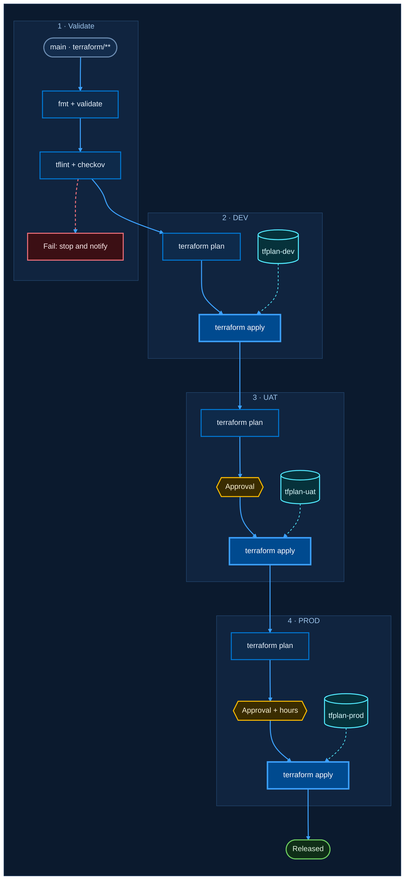

# Azure Midnight: font pairings

Palette is fixed (see `azure-midnight.md`). Each option uses two fonts:

- **Primary** (`themeVariables.fontFamily`): stage titles, approval gates, outcomes, failure notes.
- **Code** (`themeCSS` rule on the `bpCode` class): commands, triggers, artifacts, anything you would type in a terminal.

A node takes both a color class and `bpCode`, for example `class PDEV bpProcess` then `class PDEV bpCode`.

Rules learned while building these:

- `themeVariables` values must not contain `-` or `'`. Mermaid silently drops the whole init block otherwise, so the stacks below have no quotes and no `sans-serif`.
- A `classDef` cannot carry a font stack: commas split declarations and `\,` is not honoured. Use `themeCSS` instead.
- Azure DevOps wiki does not load web fonts. Options A and B use fonts that ship with Windows 11. Options C and D need the font installed on the viewer's machine and otherwise fall back to Segoe UI and Cascadia Mono.

| Option | Primary | Code | Availability |
|---|---|---|---|
| A · Segoe + Cascadia | `Segoe UI Variable Text, Segoe UI, Helvetica, Arial` | `Cascadia Code, Cascadia Mono, Consolas, monospace` | Windows 11 system fonts |
| B · Bahnschrift + Cascadia Mono | `Bahnschrift, Segoe UI, Helvetica, Arial` | `Cascadia Mono, Consolas, monospace` | Windows 11 system fonts |
| C · Geist + Geist Mono | `Geist, Segoe UI, Helvetica, Arial` | `Geist Mono, Cascadia Mono, Consolas, monospace` | Google Fonts / install locally |
| D · Red Hat Text + Red Hat Mono | `Red Hat Text, Segoe UI, Helvetica, Arial` | `Red Hat Mono, Cascadia Mono, Consolas, monospace` | Google Fonts / install locally |

## Option A: Segoe + Cascadia

The Windows and Azure DevOps house style. Calm and very legible; Cascadia is the Windows Terminal font.

## Option B: Bahnschrift + Cascadia Mono

DIN-style signage face. Narrow and technical, like control-room labels. Fits long resource names.

## Option C: Geist + Geist Mono

Sharp, modern developer-tool look. Sans and mono share one design, so the pair feels seamless.

## Option D: Red Hat Text + Red Hat Mono

Warmer and rounder geometry. Friendly for docs read by non-engineers; the mono stays readable.

