# Azure Midnight: icons

Chosen standard: Azure Midnight palette, Geist for titles and gates, Geist Mono for commands and artifacts.
This page adds icons.

## How icons are added

Each icon is a small `` inside the node label, loaded from the Iconify API. It works in any Markdown
renderer that runs Mermaid 10 or 11 and allows images in labels.

```text
PDEV[" terraform plan"]
```

- **Brand logos** (`logos:`, `devicon:`, `vscode-icons:`) keep their own colours. Use them once, where the product enters the flow.
- **Concept icons** (`fluent:*-24-regular`) are single-colour. Tint them with `?color=%23<hex>` using the role colour (the `%23` is an encoded `#`).
- One `themeCSS` rule places the icon left of the text:
  `.nodeLabel img { display: inline-block !important; width: 18px !important; height: 18px !important; vertical-align: middle; margin: 0 8px 2px 0 !important; }`.
  Mermaid otherwise stacks the image above the text and stretches it to full width.
- Set `"wrappingWidth": 280` in the flowchart config so the extra icon width does not wrap short labels.
- Do not use `@{ img: ... }` nodes. They need Mermaid 11.3 or later and draw a light label background that breaks the dark theme.
- Do not use `@{ icon: ... }` or `fa:`. They need icon packs registered by the host page, which Markdown renderers do not do.

## Where it renders

| Renderer | Status |
|---|---|
| Mermaid 10 and 11 in a browser (mermaid.live, docs sites, VS Code preview) | Checked: 16 of 16 icons load, 0 overlaps, 0 crossings, 0 clipped labels |
| GitHub Markdown | Not checked yet |
| Azure DevOps wiki | Not checked yet. Microsoft's docs say most HTML tags are unsupported in wiki Mermaid, so icons may be stripped. Keep the icon-free version (`azure-midnight-fonts.md`, option C) as the wiki fallback |
| Offline / air-gapped | Icons will not load. They come from api.iconify.design at view time |

## Icons in the pipeline diagram

| Node | Icon | Tint | Meaning |
|---|---|---|---|
| TRG | `devicon:azuredevops` | brand | Pipeline trigger (Azure DevOps brand logo) |
| FMT | `logos:terraform-icon` | brand | First Terraform step (Terraform brand logo) |
| SCAN | `fluent:shield-task-24-regular` | `#3ca0ff` | Lint and security scan |
| STOP | `fluent:dismiss-circle-24-regular` | `#f1707b` | Failure |
| PDEV | `fluent:clipboard-task-list-ltr-24-regular` | `#3ca0ff` | Plan |
| TFD | `fluent:document-lock-24-regular` | `#50e6ff` | Saved plan artifact |
| GUAT | `fluent:person-available-24-regular` | `#ffb900` | Manual approval |
| GPRD | `fluent:calendar-clock-24-regular` | `#ffb900` | Approval plus business-hours check |
| ADEV | `fluent:cloud-arrow-up-24-regular` | `#e6f1ff` | Apply to Azure |
| DONE | `fluent:checkmark-circle-24-regular` | `#6ccb5f` | Released |

## Icon kit for Azure and Azure DevOps diagrams

All names below were checked against the Iconify API. Tint names refer to the palette: process `#3ca0ff`,
data `#50e6ff`, decision `#ffb900`, success `#6ccb5f`, error `#f1707b`, neutral `#e6f1ff`.

### Platforms and tools

Brand logos in their own colours. Use once per diagram, where the product enters the flow.

| Use for | Icon | Tint | Example |
|---|---|---|---|
| Azure | `devicon:azure` | brand | Cloud boundary, subscription |
| Azure DevOps | `devicon:azuredevops` | brand | Pipeline trigger, project |
| Azure Pipelines | `vscode-icons:file-type-azurepipelines` | brand | Pipeline definition (YAML) |
| Terraform | `logos:terraform-icon` | brand | Terraform step or module |
| Bicep | `vscode-icons:file-type-bicep` | brand | Bicep template |
| PowerShell | `devicon:powershell` | brand | Script step |
| Kubernetes / AKS | `devicon:kubernetes` | brand | Cluster |
| Docker / ACR | `devicon:docker` | brand | Container image, registry |
| Cosmos DB | `devicon:cosmosdb` | brand | Cosmos DB account |
| Azure SQL | `devicon:azuresqldatabase` | brand | SQL database |

### Azure services

Iconify has no official Azure service icons, so these single-colour Fluent icons stand in, tinted by role.

| Use for | Icon | Tint | Example |
|---|---|---|---|
| Key Vault | `fluent:key-24-regular` | data | Secrets, certificates |
| Entra ID / identity | `fluent:shield-lock-24-regular` | process | Tenant, managed identity, RBAC |
| Storage account | `fluent:hard-drive-24-regular` | data | Blob, tfstate backend |
| Database (generic) | `fluent:database-24-regular` | data | Any data store |
| App Service | `fluent:window-24-regular` | process | Web app, API |
| Function App | `fluent:flash-24-regular` | process | Serverless function |
| Virtual machine | `fluent:server-24-regular` | process | VM, agent pool |
| Virtual network | `fluent:virtual-network-20-regular` | process | VNet, subnet, peering |
| Router / gateway | `fluent:router-24-regular` | process | VPN, NAT, App Gateway |
| Public endpoint | `fluent:globe-24-regular` | neutral | Internet, Front Door, DNS |
| Monitor | `fluent:data-trending-24-regular` | process | Log Analytics, App Insights |
| Resource group | `fluent:box-24-regular` | neutral | Resource group, package |
| Service connection | `fluent:plug-connected-24-regular` | neutral | ADO service connection, OIDC |
| Tags / policy | `fluent:tag-24-regular` | neutral | Tags, Azure Policy |

### Pipeline steps

Tinted blue for work, cyan for artifacts.

| Use for | Icon | Tint | Example |
|---|---|---|---|
| Branch / trigger | `fluent:branch-24-regular` | process | Branch, PR trigger |
| Plan | `fluent:clipboard-task-list-ltr-24-regular` | process | terraform plan, what-if |
| Apply / deploy | `fluent:cloud-arrow-up-24-regular` | neutral | terraform apply, deploy |
| Saved plan / artifact | `fluent:document-lock-24-regular` | data | tfplan, pipeline artifact |
| Scan / lint | `fluent:shield-task-24-regular` | process | tflint, checkov, Defender |
| Test | `fluent:beaker-24-regular` | process | Terratest, Pester |
| Script | `fluent:window-console-20-regular` | process | Inline script, CLI |
| Code | `fluent:code-24-regular` | process | Repository, source |
| Sync / drift | `fluent:arrow-sync-24-regular` | process | Drift detection, refresh |
| Release | `fluent:rocket-24-regular` | success | Release, go-live |
| Schedule | `fluent:timer-24-regular` | neutral | Scheduled trigger |
| Archive / backup | `fluent:archive-24-regular` | data | Backup, retention |

### Gates, people and status

Amber for human decisions, green and red for outcomes.

| Use for | Icon | Tint | Example |
|---|---|---|---|
| Approval | `fluent:person-available-24-regular` | decision | Manual approval check |
| Business hours | `fluent:calendar-clock-24-regular` | decision | Time-window check |
| User | `fluent:person-24-regular` | neutral | Actor, operator |
| Team | `fluent:people-team-24-regular` | neutral | Team, group |
| Success | `fluent:checkmark-circle-24-regular` | success | Released, passed |
| Failure | `fluent:dismiss-circle-24-regular` | error | Failed, blocked |
| Warning | `fluent:warning-24-regular` | decision | Degraded, caution |
| Alert | `fluent:alert-24-regular` | error | Alert rule, page |
| Notify | `fluent:mail-24-regular` | neutral | Email, Teams message |
| Lock | `fluent:lock-closed-24-regular` | neutral | State lock, private access |

## Diagram source

```mermaid
%%{init: {"theme":"base","themeVariables":{"fontFamily":"Geist, Segoe UI, Helvetica, Arial","fontSize":"15px","primaryColor":"#0e2a4a","primaryBorderColor":"#0078d4","primaryTextColor":"#e6f1ff","textColor":"#e6f1ff","lineColor":"#3ca0ff","titleColor":"#9cc3ea","clusterBkg":"#10243f","clusterBorder":"#24476f","edgeLabelBackground":"#0b1a2e","background":"#0b1a2e"},"themeCSS":".nodeLabel img { display: inline-block !important; width: 18px !important; height: 18px !important; vertical-align: middle; margin: 0 8px 2px 0 !important; } .bpCode .nodeLabel { font-family: Geist Mono, Cascadia Mono, Consolas, monospace; } .cluster-label .nodeLabel { font-weight: 600; letter-spacing: 0.01em; }","flowchart":{"curve":"basis","nodeSpacing":36,"rankSpacing":44,"padding":16,"wrappingWidth":280}}}%%
graph TB
  subgraph CANVAS[" "]
    direction TB
    subgraph VAL["1 · Validate"]
      TRG(["<img src='https://api.iconify.design/devicon/azuredevops.svg' width='18' height='18'/> main · terraform/**"])
      FMT["<img src='https://api.iconify.design/logos/terraform-icon.svg' width='18' height='18'/> fmt + validate"]
      SCAN["<img src='https://api.iconify.design/fluent/shield-task-24-regular.svg?color=%233ca0ff' width='18' height='18'/> tflint + checkov"]
      STOP["<img src='https://api.iconify.design/fluent/dismiss-circle-24-regular.svg?color=%23f1707b' width='18' height='18'/> Fail: stop and notify"]
    end
    subgraph DEV["2 · DEV"]
      PDEV["<img src='https://api.iconify.design/fluent/clipboard-task-list-ltr-24-regular.svg?color=%233ca0ff' width='18' height='18'/> terraform plan"]
      TFD[("<img src='https://api.iconify.design/fluent/document-lock-24-regular.svg?color=%2350e6ff' width='18' height='18'/> tfplan-dev")]
      ADEV["<img src='https://api.iconify.design/fluent/cloud-arrow-up-24-regular.svg?color=%23e6f1ff' width='18' height='18'/> terraform apply"]
    end
    subgraph UAT["3 · UAT"]
      PUAT["<img src='https://api.iconify.design/fluent/clipboard-task-list-ltr-24-regular.svg?color=%233ca0ff' width='18' height='18'/> terraform plan"]
      TFU[("<img src='https://api.iconify.design/fluent/document-lock-24-regular.svg?color=%2350e6ff' width='18' height='18'/> tfplan-uat")]
      GUAT{{"<img src='https://api.iconify.design/fluent/person-available-24-regular.svg?color=%23ffb900' width='18' height='18'/> Approval"}}
      AUAT["<img src='https://api.iconify.design/fluent/cloud-arrow-up-24-regular.svg?color=%23e6f1ff' width='18' height='18'/> terraform apply"]
    end
    subgraph PRD["4 · PROD"]
      PPRD["<img src='https://api.iconify.design/fluent/clipboard-task-list-ltr-24-regular.svg?color=%233ca0ff' width='18' height='18'/> terraform plan"]
      TFP[("<img src='https://api.iconify.design/fluent/document-lock-24-regular.svg?color=%2350e6ff' width='18' height='18'/> tfplan-prod")]
      GPRD{{"<img src='https://api.iconify.design/fluent/calendar-clock-24-regular.svg?color=%23ffb900' width='18' height='18'/> Approval + hours"}}
      APRD["<img src='https://api.iconify.design/fluent/cloud-arrow-up-24-regular.svg?color=%23e6f1ff' width='18' height='18'/> terraform apply"]
    end
    DONE(["<img src='https://api.iconify.design/fluent/checkmark-circle-24-regular.svg?color=%236ccb5f' width='18' height='18'/> Released"])
  end

  TRG --> FMT
  FMT --> SCAN
  SCAN -.-> STOP
  SCAN --> PDEV
  PDEV --> ADEV
  TFD -.-> ADEV
  ADEV --> PUAT
  PUAT --> GUAT
  GUAT --> AUAT
  TFU -.-> AUAT
  AUAT --> PPRD
  PPRD --> GPRD
  GPRD --> APRD
  TFP -.-> APRD
  APRD --> DONE

  classDef bpUser fill:#132c4c,stroke:#6b8bb0,stroke-width:2px,color:#e6f1ff
  classDef bpProcess fill:#0e2a4a,stroke:#0078d4,stroke-width:2px,color:#e6f1ff
  classDef bpInfo fill:#004a8f,stroke:#3ca0ff,stroke-width:3px,color:#ffffff
  classDef bpData fill:#06323b,stroke:#50e6ff,stroke-width:2px,color:#d6fbff
  classDef bpDecision fill:#3a2c00,stroke:#ffb900,stroke-width:2px,color:#fff4ce
  classDef bpSuccess fill:#0f2e17,stroke:#6ccb5f,stroke-width:2px,color:#dff6dd
  classDef bpError fill:#3b0f14,stroke:#f1707b,stroke-width:2px,color:#fde7e9
  classDef bpCode stroke-dasharray:0
  class TRG bpUser
  class FMT,SCAN,PDEV,PUAT,PPRD bpProcess
  class ADEV,AUAT,APRD bpInfo
  class TFD,TFU,TFP bpData
  class GUAT,GPRD bpDecision
  class DONE bpSuccess
  class STOP bpError
  class TRG,FMT,SCAN,PDEV,ADEV,PUAT,AUAT,PPRD,APRD,TFD,TFU,TFP bpCode

  style CANVAS fill:#0b1a2e,stroke:#1f3a5f,stroke-width:1px,color:#0b1a2e
  style VAL fill:#10243f,stroke:#24476f,stroke-width:1px,color:#9cc3ea
  style DEV fill:#10243f,stroke:#24476f,stroke-width:1px,color:#9cc3ea
  style UAT fill:#10243f,stroke:#24476f,stroke-width:1px,color:#9cc3ea
  style PRD fill:#10243f,stroke:#24476f,stroke-width:1px,color:#9cc3ea

  linkStyle default stroke:#3ca0ff,stroke-width:2px
  linkStyle 2 stroke:#f1707b,stroke-width:2px,stroke-dasharray:5 4
  linkStyle 5,9,13 stroke:#50e6ff,stroke-width:1.5px,stroke-dasharray:4 4
```


