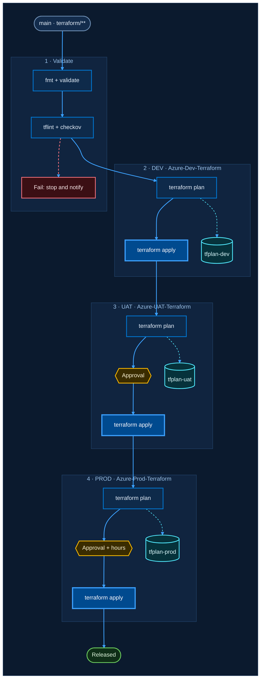

# Theme proposal: Azure Midnight

Azure portal and Fluent inspired. Deep navy, Azure blue and cyan, Segoe UI which ships with Windows and Azure DevOps.

- **Font stack**: `Segoe UI Variable Text, Segoe UI, Noto Sans, Helvetica, Arial`
- **Canvas**: `#0b1a2e` (border `#1f3a5f`)
- **Stage (subgraph)**: fill `#10243f`, border `#24476f`, title `#9cc3ea`
- **Edges**: main `#3ca0ff`, data `#50e6ff`, failure `#f1707b`
- **Curve**: `basis`

| Role | classDef | Fill | Stroke | Text |
|---|---|---|---|---|
| Trigger / actor | `bpUser` | `#132c4c` | `#6b8bb0` | `#e6f1ff` |
| Pipeline step | `bpProcess` | `#0e2a4a` | `#0078d4` | `#e6f1ff` |
| Apply (changes infra) | `bpInfo` | `#004a8f` | `#3ca0ff` | `#ffffff` |
| Artifact / state | `bpData` | `#06323b` | `#50e6ff` | `#d6fbff` |
| Approval gate | `bpDecision` | `#3a2c00` | `#ffb900` | `#fff4ce` |
| Success | `bpSuccess` | `#0f2e17` | `#6ccb5f` | `#dff6dd` |
| Failure | `bpError` | `#3b0f14` | `#f1707b` | `#fde7e9` |

## Example: Terraform multi-environment pipeline

Portable subset: `graph` keyword, no FontAwesome, no HTML in labels, no edges to or from subgraphs.
For an Azure DevOps wiki page, the same body also works inside a `::: mermaid` block.

