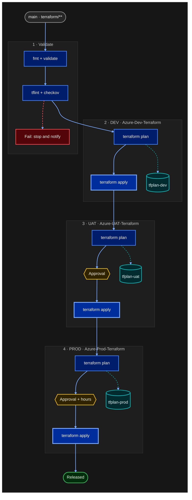

# Theme proposal: Carbon Night

Dark evolution of the current Blueprint system. Same semantic colors, dark surfaces, IBM Plex Sans.

- **Font stack**: `IBM Plex Sans, Segoe UI, Helvetica, Arial`
- **Canvas**: `#161616` (border `#393939`)
- **Stage (subgraph)**: fill `#1e1e1e`, border `#393939`, title `#c6c6c6`
- **Edges**: main `#78a9ff`, data `#08bdba`, failure `#fa4d56`
- **Curve**: `basis`

| Role | classDef | Fill | Stroke | Text |
|---|---|---|---|---|
| Trigger / actor | `bpUser` | `#262626` | `#8d8d8d` | `#f4f4f4` |
| Pipeline step | `bpProcess` | `#001d6c` | `#4589ff` | `#f4f4f4` |
| Apply (changes infra) | `bpInfo` | `#002d9c` | `#78a9ff` | `#ffffff` |
| Artifact / state | `bpData` | `#022b30` | `#08bdba` | `#d9fbfb` |
| Approval gate | `bpDecision` | `#302400` | `#f1c21b` | `#fcf4d6` |
| Success | `bpSuccess` | `#022d0d` | `#42be65` | `#defbe6` |
| Failure | `bpError` | `#520408` | `#fa4d56` | `#fff1f1` |

## Example: Terraform multi-environment pipeline

Portable subset: `graph` keyword, no FontAwesome, no HTML in labels, no edges to or from subgraphs.
For an Azure DevOps wiki page, the same body also works inside a `::: mermaid` block.

