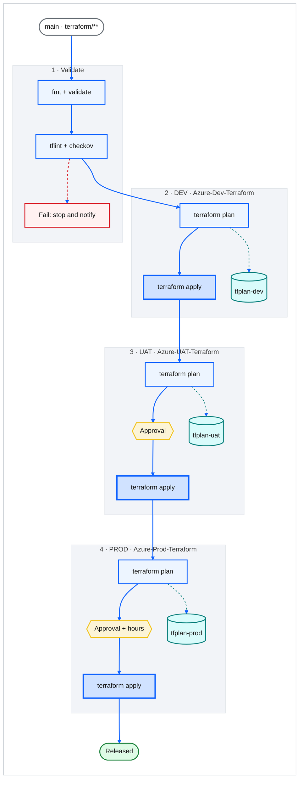

# Theme proposal: Carbon Paper

Light control option. The current Blueprint palette tightened up, for printed docs and light wiki pages.

- **Font stack**: `IBM Plex Sans, Segoe UI, Helvetica, Arial`
- **Canvas**: `#ffffff` (border `#c1c7cd`)
- **Stage (subgraph)**: fill `#f2f4f8`, border `#dde1e6`, title `#393939`
- **Edges**: main `#0f62fe`, data `#007d79`, failure `#da1e28`
- **Curve**: `basis`

| Role | classDef | Fill | Stroke | Text |
|---|---|---|---|---|
| Trigger / actor | `bpUser` | `#ffffff` | `#697077` | `#161616` |
| Pipeline step | `bpProcess` | `#edf5ff` | `#0f62fe` | `#161616` |
| Apply (changes infra) | `bpInfo` | `#d0e2ff` | `#0f62fe` | `#161616` |
| Artifact / state | `bpData` | `#d9fbfb` | `#007d79` | `#161616` |
| Approval gate | `bpDecision` | `#fcf4d6` | `#f1c21b` | `#161616` |
| Success | `bpSuccess` | `#defbe6` | `#198038` | `#161616` |
| Failure | `bpError` | `#fff1f1` | `#da1e28` | `#161616` |

## Example: Terraform multi-environment pipeline

Portable subset: `graph` keyword, no FontAwesome, no HTML in labels, no edges to or from subgraphs.
For an Azure DevOps wiki page, the same body also works inside a `::: mermaid` block.

