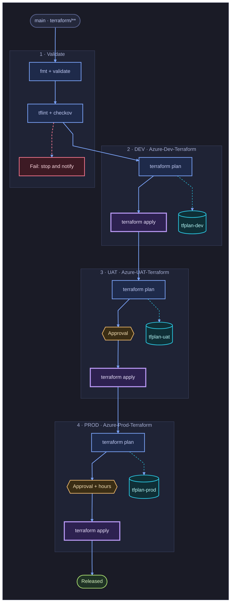

# Theme proposal: Terminal Neon

Editor-style dark (Tokyo Night family). Soft neon strokes, monospace labels that read like the commands they are.

- **Font stack**: `JetBrains Mono, Cascadia Code, Consolas, monospace`
- **Canvas**: `#1a1b26` (border `#2f334d`)
- **Stage (subgraph)**: fill `#1f2335`, border `#3b4261`, title `#a9b1d6`
- **Edges**: main `#7aa2f7`, data `#2ac3de`, failure `#f7768e`
- **Curve**: `linear`

| Role | classDef | Fill | Stroke | Text |
|---|---|---|---|---|
| Trigger / actor | `bpUser` | `#24283b` | `#565f89` | `#c0caf5` |
| Pipeline step | `bpProcess` | `#1e2a4a` | `#7aa2f7` | `#c0caf5` |
| Apply (changes infra) | `bpInfo` | `#2d2150` | `#bb9af7` | `#e9e0ff` |
| Artifact / state | `bpData` | `#0f2f36` | `#2ac3de` | `#b4f9f8` |
| Approval gate | `bpDecision` | `#3a2d14` | `#e0af68` | `#f5deb3` |
| Success | `bpSuccess` | `#1f3325` | `#9ece6a` | `#d8f5c0` |
| Failure | `bpError` | `#3d1a24` | `#f7768e` | `#ffd6de` |

## Example: Terraform multi-environment pipeline

Portable subset: `graph` keyword, no FontAwesome, no HTML in labels, no edges to or from subgraphs.
For an Azure DevOps wiki page, the same body also works inside a `::: mermaid` block.

