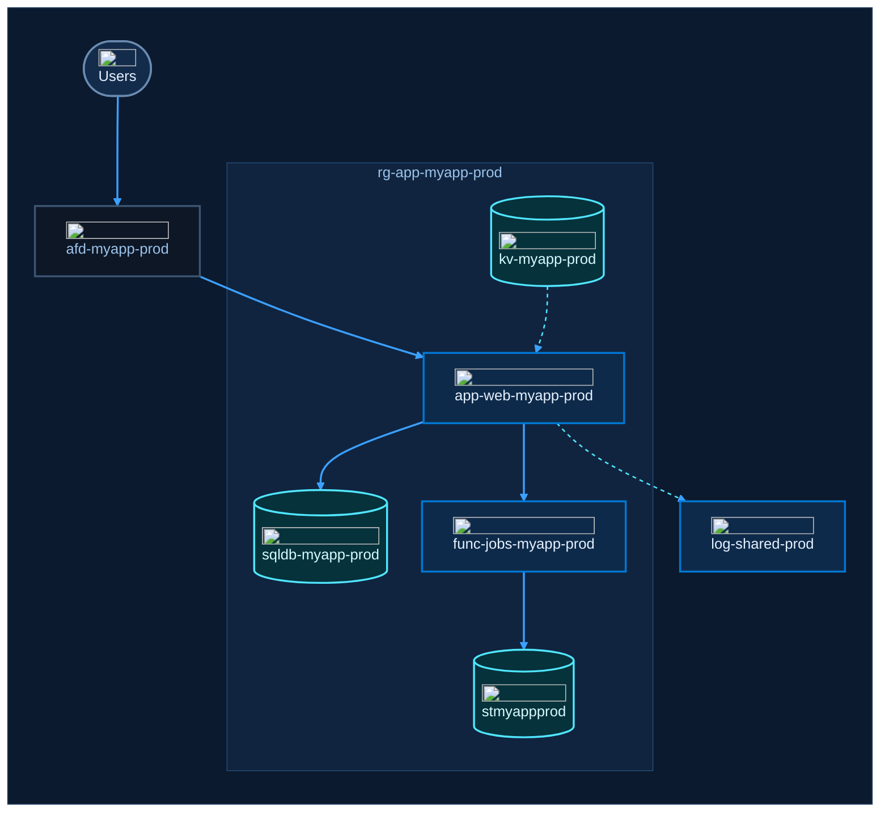

# Template: Azure application architecture

A web app behind Front Door, with its data services in one resource group and logs sent to a shared workspace.
The flow is a tree (every service has one parent), which keeps it free of crossing lines.
Solid lines carry requests; dashed cyan lines carry secrets, data or telemetry.

