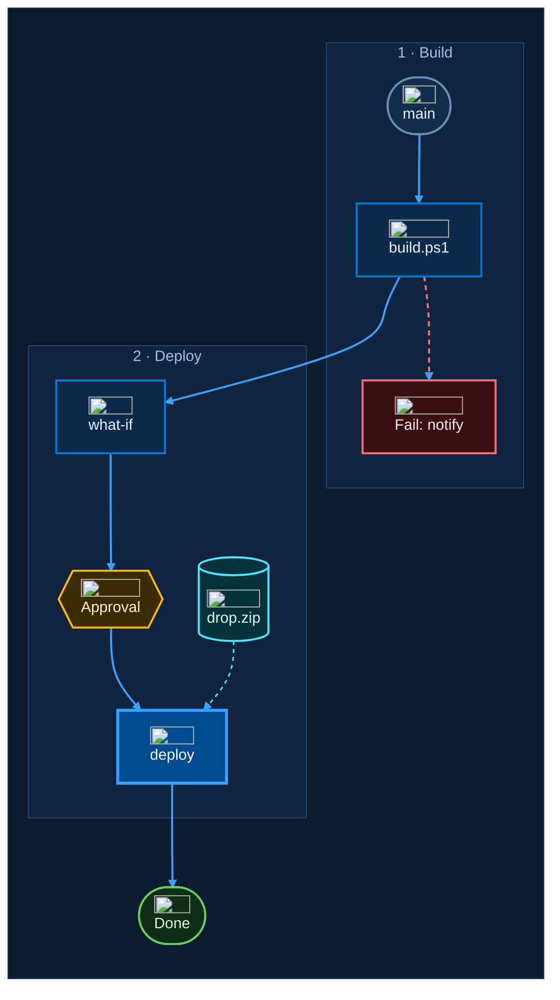

# Template: flowchart starter

Copy this block, keep the `%%{init}%%` line, the class definitions and the styles as they are, and replace the
nodes and edges. Remove the `` parts for the Azure DevOps wiki.

Checklist while editing:

- Keep the outer `CANVAS` subgraph and its `direction TB` line.
- Link nodes to nodes. Never link to a subgraph id.
- Count edges from 0 in the order they are written; `linkStyle` uses those numbers.
- Add every command, file name and resource name to the `bpCode` class line.

