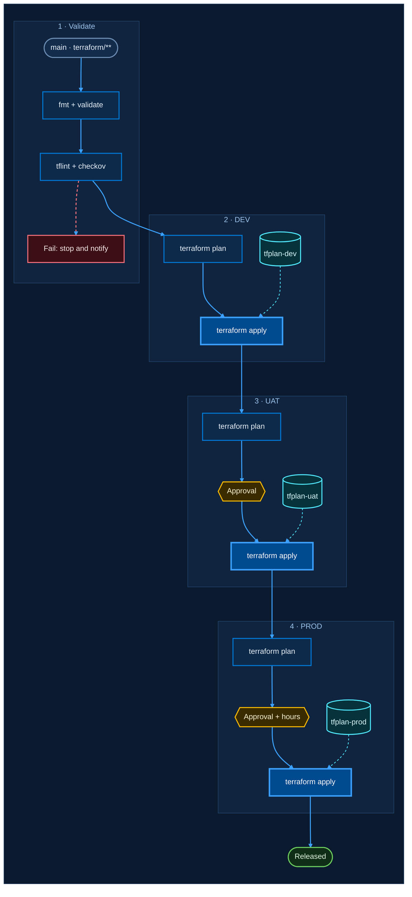

# Template: Terraform multi-environment pipeline

Approved reference diagram. Validate, then DEV, UAT with approval, PROD with approval and business-hours check.
Each environment applies its own saved plan.

## With icons (GitHub, VS Code, docs sites)

## Without icons (Azure DevOps wiki)

Same diagram, icons removed. Use this on the wiki until icons are confirmed to render there.

