# Template: sequence diagram

Use for request flows and event chains, for example a pipeline talking to Azure. This is the most reliable diagram
type in the Azure DevOps wiki. Sequence diagrams take no icons and no `classDef`; colour comes from the
`themeVariables` below and from `rect` blocks that group phases.

The outer `box rgb(11, 26, 46)` paints the dark canvas behind every participant, so message text stays readable on a
light wiki page. Keep it, and keep all participants inside it.

```mermaid
%%{init: {"theme":"base","themeVariables":{"fontFamily":"Geist, Segoe UI, Helvetica, Arial","fontSize":"15px","background":"#0b1a2e","primaryTextColor":"#e6f1ff","textColor":"#e6f1ff","lineColor":"#3ca0ff","actorBkg":"#0e2a4a","actorBorder":"#0078d4","actorTextColor":"#e6f1ff","actorLineColor":"#24476f","signalColor":"#3ca0ff","signalTextColor":"#e6f1ff","labelBoxBkgColor":"#10243f","labelBoxBorderColor":"#24476f","labelTextColor":"#9cc3ea","loopTextColor":"#9cc3ea","noteBkgColor":"#3a2c00","noteBorderColor":"#ffb900","noteTextColor":"#fff4ce","activationBkgColor":"#004a8f","activationBorderColor":"#3ca0ff","sequenceNumberColor":"#0b1a2e"},"sequence":{"mirrorActors":false,"messageMargin":40,"boxMargin":12,"actorMargin":60,"width":190,"noteMargin":12}}}%%
sequenceDiagram
  autonumber
  box rgb(11, 26, 46)
    participant ADO as Azure DevOps
    participant ID as Entra ID
    participant ST as tfstate storage
    participant ARM as Resource Manager
  end

  rect rgb(16, 36, 63)
    ADO->>ID: request token (workload identity)
    ID-->>ADO: access token
  end
  rect rgb(16, 36, 63)
    ADO->>ST: terraform init (lease state)
    ADO->>ARM: terraform plan
    ARM-->>ADO: current resources
  end
  Note over ADO,ID: Approval + business hours
  rect rgb(16, 36, 63)
    ADO->>ARM: terraform apply tfplan-prod
    ARM-->>ADO: provisioning result
    ADO->>ST: write state, release lease
  end
```

